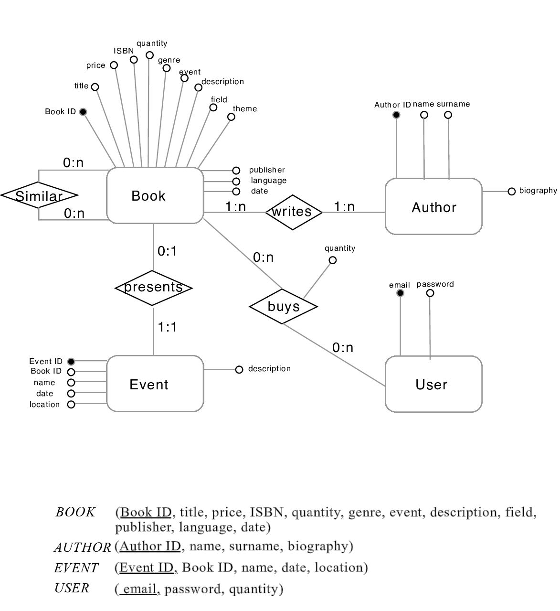

# Documentation of the Backend part
> Deliverable D1
## General group information
| Member n. | Role | First name | Last Name | Matricola | Email address |
| --------- | ------------- | ---------- | --------- | --------- | --------------- | 
| 1 | administrator | Roland | Reylander | 10539438 | 10539438@polimi.it | 
| 2 | member | Alessandro | Ferraiuolo | 10490631 | alessandromarco.ferraiuolo@mail.polimi.it | 
| 3 | member | Xin | Meng | 10671564 | 10671564@polimi.it |
## Links to other deliverables
- Deliverable D0: the web application is accessible at [this address](https://hypermedia-app.herokuapp.com).
- Deliverable D2: the YAML or JSON file containing the specification of the app API can be found at [this address](https://hypermedia-app.herokuapp.com/backend/spec.yaml).
- Deliverable D3: the SwaggerUI page of the same API is available at [this address](https://hypermedia-app.herokuapp.com/backend/swaggerui).
- Deliverable D4: the source code of D0 is available as a zip file at [this address](https://hypermedia-app.herokuapp.com/backend/app.zip).
- Deliverable D5: the address of the online source control repository is available at [this address](https://github.com/rockplayer007/HypermediaProject.git). 
We hereby declare that this is a private repository and, upon request, we will give access to the instructors.
## Specification
### Web Architecture
*Describe here, with a diagram, the components of your web application and how they interact. Highlight which parts belong to the application layer, data layer or presentation layer. How did you ensure that HTML is not rendered server side?*
The HTML is not rendered server side. As a matter of fact in the front end the HTML pages make use of the provided APIs and with appropriate JavaScript code we retrieve only the necessary information to populate the HTML page.

### API
#### REST compliance
*Describe here to what extent did you follow REST principles and what are the reasons for which you might have decided to diverge. Note, you must not describe the whole API here, just the design decisions.*
- **Client-server**: Client and Server can work independently. This means that the server stores and manipulates the data, whereas the Client retrieves these data. 
- **Stateless**: this principle is not fully respected as we store the user's session on the server. Doing so allows to keep track of the logged-in state and can give to the user his own information, such us the books he added to his personal cart.
- **Cacheable**: we opted not to cache any information.
- **Layered system**: there was no need to consider this, so there is no intermediate layer between the server and the client
- **Code on demand**: clearly this has not been taken into consideration as the website does not render server side.
- **Uniform interface**: this made the collaboration between all the components, so this principle has been followed
#### OpenAPI Resource models
*Describe here synthetically, which models you have introduced for resources.*
All the resources that arrive using the API are Json files. This allows to easily read required data. For the requests, in case additional parameters are required, they can be added either in the path (e.g. [GET /books/1](http://hypermedia-app.herokuapp.com/v2/books/1)) or as a formData like we did in the users' POST and PUT request.
In case a wrong request is made, for example a specific book request with an ID that does not exist, the request will answer with an empty json ([GET /books/100](http://hypermedia-app.herokuapp.com/v2/books/100)).
Another scenario can be that the user's books are requested but the user is not logged in. In that case the GET request will response with **{"loggedIn": false}**.
Similarly when a user tries to log in with wrong credentials the response will be the same as before, whereas if the credentials are correct the response will be **{"loggedIn": true}**. The same, but with a slightly different response happens when the user tries to register with an already existing email.
### Data model
*Describe with an ER diagram the model used in the data layer of your web application. How these map to the OpenAPI data model?*
All the information can be retrieved through the provided API. The requests correspond to queries made server side, for example the request for the authors given a specific book uses this API [GET /books/1/author](https://hypermedia-app.herokuapp.com/v2/books/1/author) and in the backend the query is made in such a way that it is going to find the book with the given id and then finds all the authors who have written that book.
Users can add books only after a registration or a login (the data password of the user is encrypted). In the same way it is possible to see the users' own books only after a login.

## Implementation
### Tools used
*Describe here which tools, languages and frameworks did you use for the backend of the application.*
The whole backend part is made in NodeJS. In addition we have used the following libraries:
- **js-yaml**: for parsing the YAML
- **swagger-tools**: useful to use the Swagger easily
- **knex**: to managing Postgres queries
- **pg**: to use PostgreSQL on NodeJS
- **bcrypt**: to hash the passwords in the database
- **cookie-parser** and **cookie-session**: to manage cookies and session of the user
### Discussion
Describe here:
- *How did you make sure your web application adheres to the provided OpenAPI specification?*
With the [Swagger editor](https://editor.swagger.io/) it was possible to write OpenAPI specification and later to download the nodejs-server code from the [YAML file](https://hypermedia-app.herokuapp.com/backend/spec.yaml)
- *Why do you think your web application adheres to common practices to partition the web application (static assets vs. application data)*
Because we dynamically fill the HTML pages with the data taken from the database. The other parts of the page like pictures or the layout are static.
- *Describe synthetically why and how did you manage session state, what are the state change triggering actions (e.g., POST to login etc..).*
To get a personal session state it is necessary to register or to login through the given POST requests (/user/login and /user/register) giving an email as identifier and a password for authentication. Now it is possible to get the current logged in user with this [GET /users/logged](https://hypermedia-app.herokuapp.com/v2/users/logged). To logout the user it is necessary to use the following [GET /users/logout](https://hypermedia-app.herokuapp.com/v2/users/logout).
This is possible because we set the *req.session.userid* with the identification email which sets the user to a logged state, otherwhise the *req.session.userid* is set to *false* and therefor not logged.
- *Which technology did you use (relational or a no-SQL database) for managing the data model?*
We used PostgreSQL as a relational database, because it is free and open source.

## Other information
### Task assignment
*Describe here how development tasks have been subdivided among members of the group:*
- Xin worked on design document (100%) and usability report (90%）and the original version of design on website (100%) provide pictures to front end (5%)
- Roland worked completely on the backend part (100%), helped to join the front end with the backend (20%), fixed in overall some bugs in front end and helped for the usability report (5%)
- Alessandro worked the most on the front end (100%), on the IDM documents (100%) and gave consulting for design realization.
### Analysis of existing API
*Describe here if you have found relevant APIs that have inspired the OpenAPI specification and why (at least two).*
Professor Zaccaria's class examples have helped to understand how API work. After that we have taken a closer look to the [swagger petstore example](https://petstore.swagger.io) to get write more complex APIs and finally we got also some inspiration from some important e-commerce websites' APIs such as [Zalando](https://any-api.com/zalando_com/zalando_com/docs/API_Description) and [Just Eat](https://any-api.com/je_apis_com/je_apis_com/docs/application)
### Learning outcome
*What was the most important thing all the members have learned while developing this part of the project, what questions remained unanswered, how you will use what you've learned in your everyday life?*
- Xin learned how to communicate with engineers as a designer about the format of design outcomes and some limitations and difficulties in website design on front and back end part.
- Roland had the opportunity to learn SQL, JavaScript and some basics about HTML and CSS. Now he has a good base to learn other techniques and programming languages for database management. He is able and motivated to start his own new projects.
- Alessandro could practice his HTML, CSS and JavaScript skills. He learned how to use the developer tools offered on the Chrome browser and also adapt and overcome problems of page formatting through the understanding of how Bootstrap works and implementing manually with CSS. He will use what he learned as a starting point to understand the backend part and in future work on other similar projects.